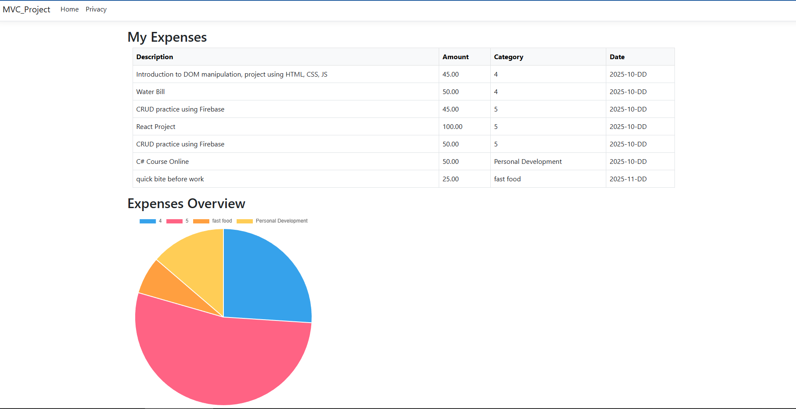

# Expense Tracker – ASP.NET Core MVC Web App

This is a **Expense Tracker** project, developed as part of my learning journey with **ASP.NET Core MVC**. The project follows the tutorial  
[**“How to Build an ASP.NET Core MVC Web App – Tutorial”**](https://www.youtube.com/watch?v=QtiM87MV27w&t=3707s).

---

## Project Overview

The tutorial demonstrates key concepts of the **Model–View–Controller (MVC)** architecture, database integration with **Entity Framework Core**, and the use of **Chart.js** for dynamic data visualization.

### Main Features
- Add, view, and manage expense records.  
- Input validation using data annotations.  
- Persistent storage through a SQL Server database.  
- Interactive charts to visualize expense distribution.  
- Asynchronous methods and service abstraction for a cleaner backend.  

---

## Technologies Used

| Category | Technology | Description |
|-----------|-------------|-------------|
| Framework | **ASP.NET Core MVC** | Backend and MVC structure. |
| ORM | **Entity Framework Core** | Database operations and data access. |
| Database | **SQL Server** | Data persistence for expense records. |
| Frontend | **Razor Views**, **HTML**, **CSS**, **Bootstrap** | User interface and responsive layout. |
| Charts | **Chart.js** | Visual representation of expenses. |
| Package Manager | **NuGet** | Dependency management. |
| Language | **C#** | Main programming language. |

---

## Project Preview

